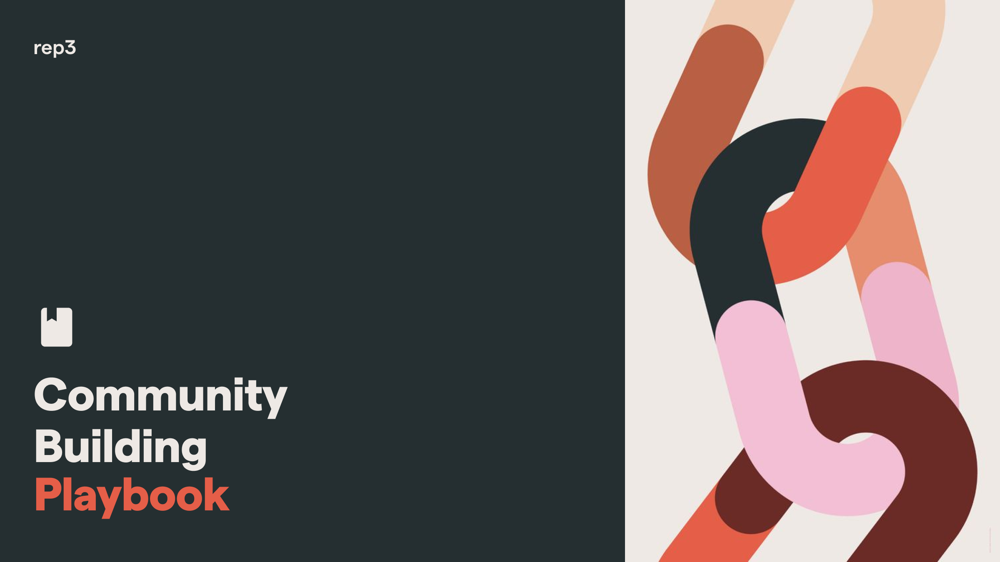

--- 
title: "Community Building Playbook"
site: bookdown::bookdown_site
documentclass: book
url: https://Drepute.github.io/playbook/
cover-image: "img/cover.png"
description: "This is community building playbook originally authored by @InfiniteGwei from rep3. This book is a public good. We strongly encourage you to read, share and contribute to this resource!"
github-repo: Drepute/playbook
---

# Hey there! {-}

In our quest to help communities maximise their potential, we couldn’t help but try and understand how communities work at a deeper level.

- What dynamics govern them? 
- How does an average community evolve over time? 
- And, most importantly, how does one start a community around an interest or a goal?

To answer these questions, we started putting together this community building playbook as a public good. And we invite you to co-create it with us!

Distilling community building to a formula is no simple task, and it is also not our intention here. Instead, we aim to open a two-way dialogue with the reader, and discuss the general direction we should move in. As a result, this public good may seem incomplete, and it shall always be so.

As participants in communities, we are all well aware of the infinite ways through which communities rise and fall. Further, technological developments add layers on these processes which breaks certains ground rules and introduces new ones.

For example, the rules of building a decentralized, digital community are slightly different from building one irl. This playbook focusses mainly on these type of communities, and highlights the concepts and practices that have *seemed* to work so far.

We invite you to share your experiences so we may refine this playbook, and make it a possible reference point for the community builders of tomorrow. 😄
